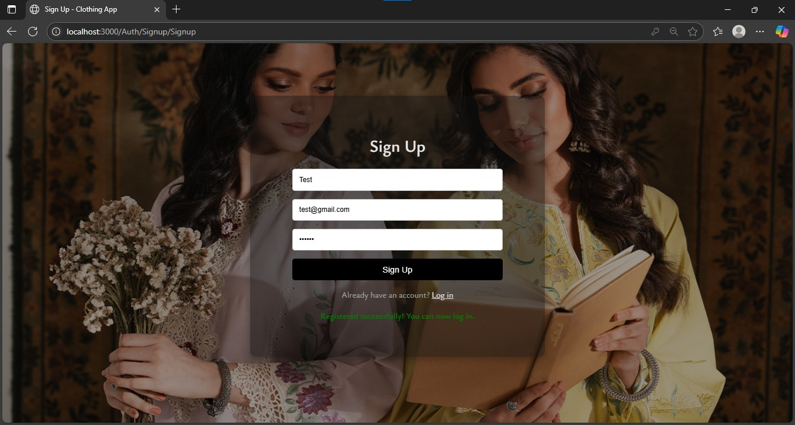
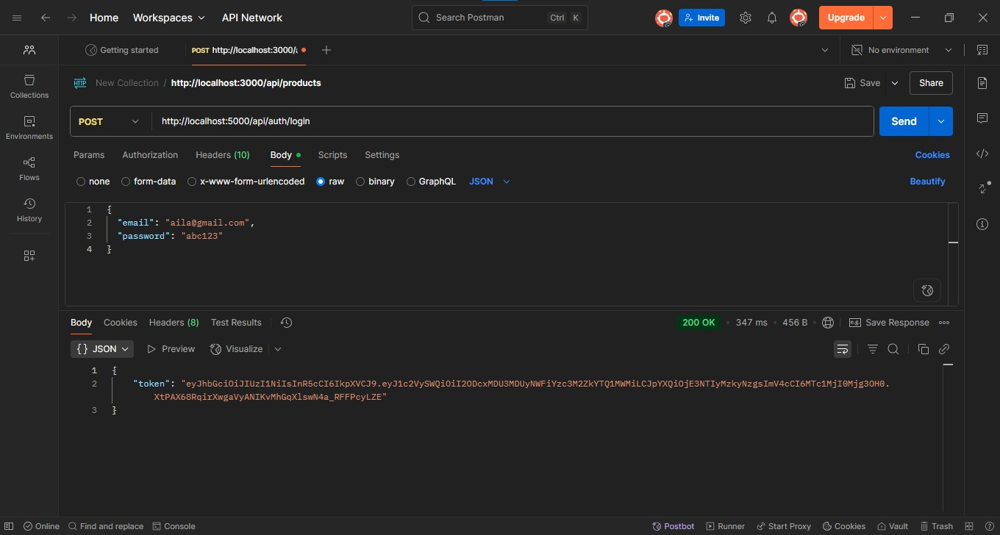
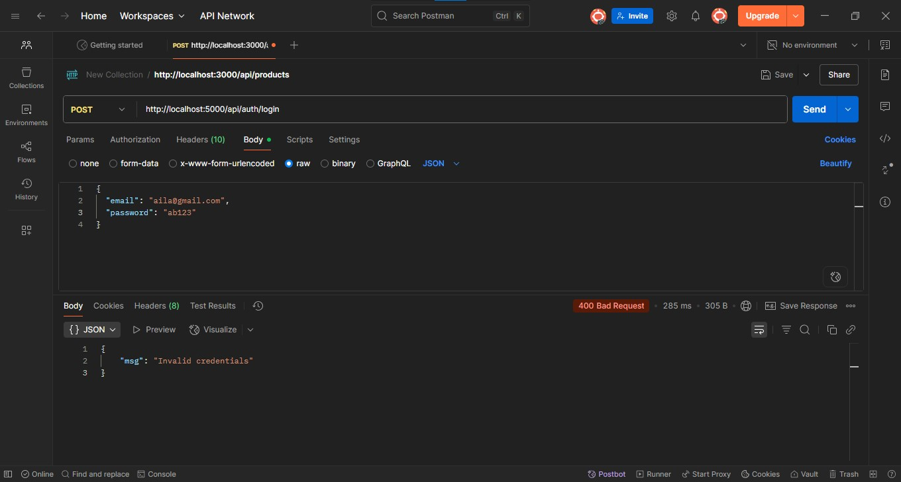
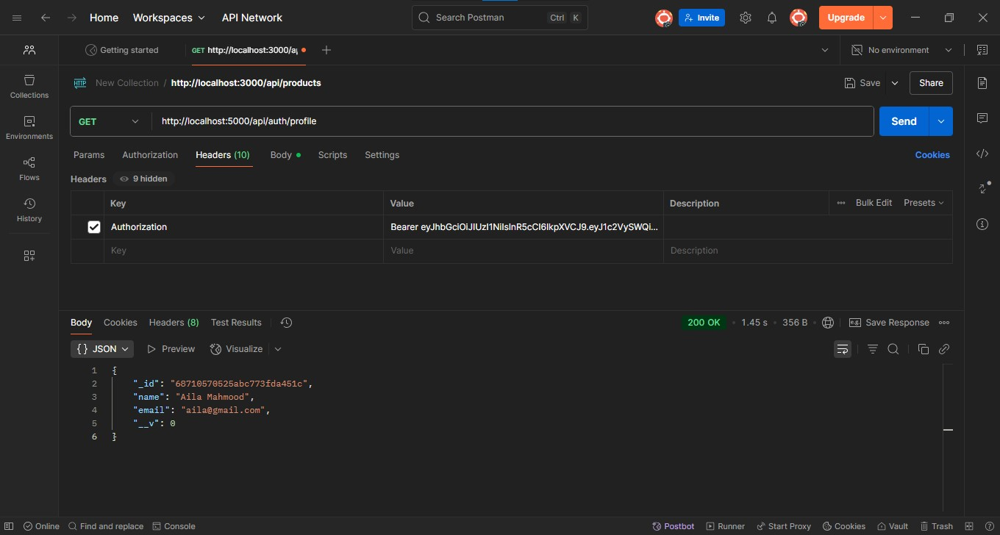
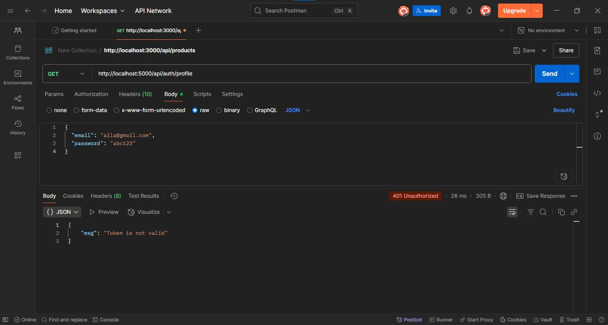
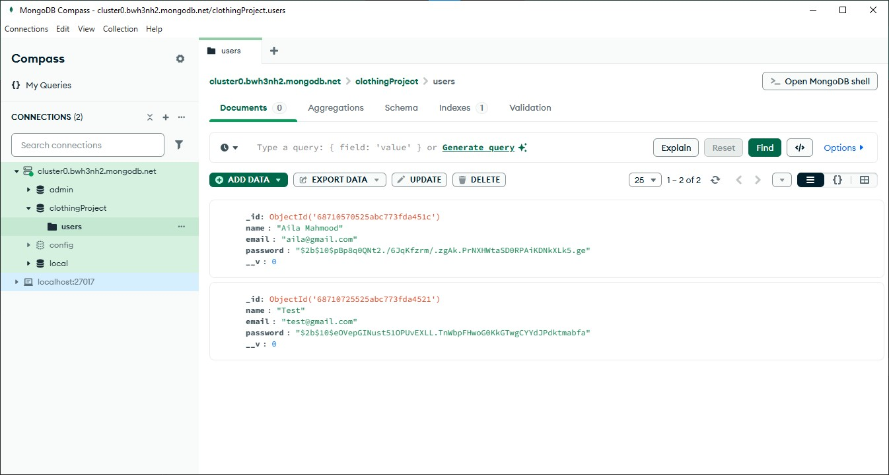

# AilaMahmood_FullStack_Week3
Connecting MongoDB Atlas to backend and creating full user signup/login flow.

This week focuses on backend development by integrating MongoDB for data persistence and adding authentication mechanisms like registration, login, JWT protection, and securing API routes.

📌 Objectives
- Integrate MongoDB Atlas with Express using Mongoose.
- Implement secure user registration and login with hashed passwords.
- Use JWT for session management and protect API endpoints.

🔧 Technologies Used
- Node.js
- Express.js
- MongoDB Atlas
- Mongoose
- bcrypt
- jsonwebtoken
- dotenv

📂 Project Structure

    /Bazeena-Clothing
        /Clothing-Backend
            /config
                db.js
            /controllers
                authController.js
                productsController.js
            /middleware
                authMiddleware.js
            /models
                User.js
            /node_modules
                ... (auto-generated dependencies)
            .env
            package.json
            package-lock.json
            server.js

        /Clothing-Frontend

        README.md

✅ Tasks Completed
1. MongoDB Atlas Setup & Integration
- A MongoDB Atlas cluster was created to store user data securely.
- Connected the cluster to the backend using Mongoose.
- Verified successful connection before launching server.

2. User Schema & Form Data Handling
- A schema was defined to store user details like name, email, and password.
- User registration form data from the frontend is sent to the backend and stored in the MongoDB collection.

3. Authentication System
- Registration: New users can register. Passwords are hashed using bcrypt before saving to the database.
- Login: Existing users can log in. Passwords are verified and a JWT is issued upon success.
- Security: JWT tokens are stored on the client side and sent with each request to access protected resources.

4. Securing Protected Routes
- Certain backend routes are secured and accessible only with a valid JWT token.
- Requests without tokens or with invalid tokens are denied access, ensuring user data security.

🚀 How to Test the Project
- Run the backend server after configuring your .env file with MongoDB URI and JWT secret.
- Use Postman or frontend UI to:
    - Register a new user
    - Log in with credentials to receive a JWT token
    - Use the token to access a protected API route
- Observe behavior for both authorized and unauthorized access.

🖼️ Screenshots (To Be Attached)

✅ Registration via form 
    

✅ Login with correct credentials (token generated)
    

✅ Login with incorrect credentials
    

✅ Token-based access to protected route
    

✅ Access denied without token / invalid token
    

✅ Sample data in MongoDB
    